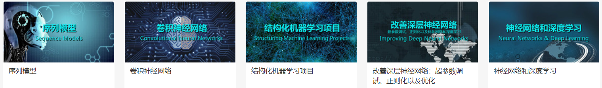
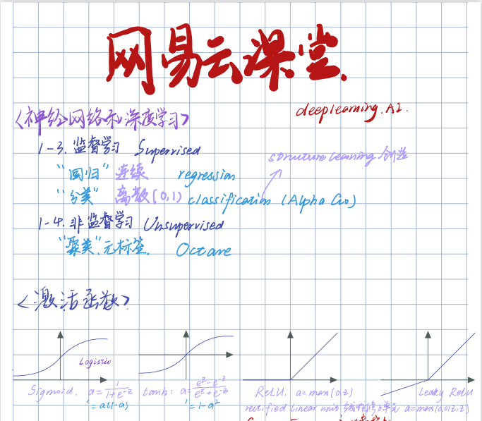
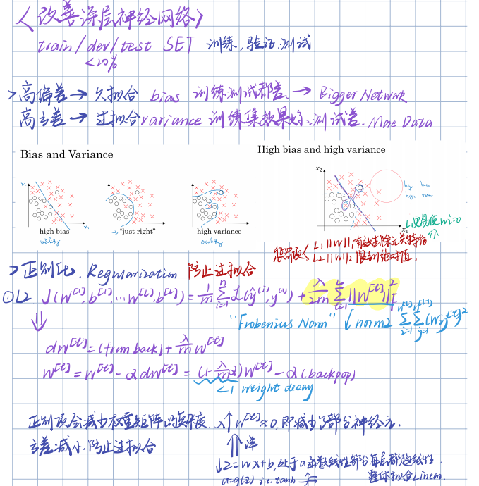
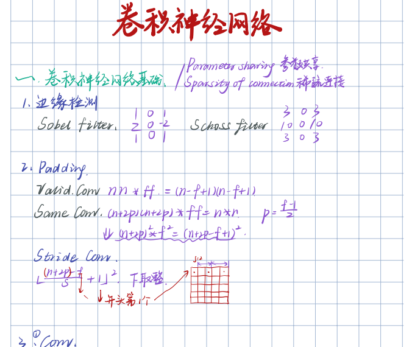
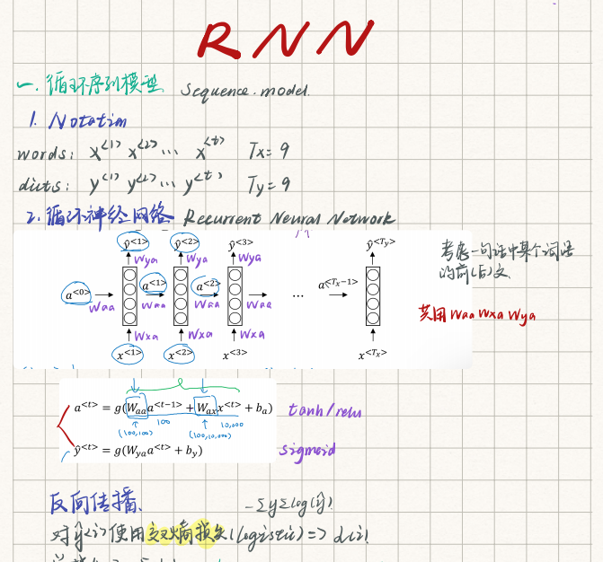
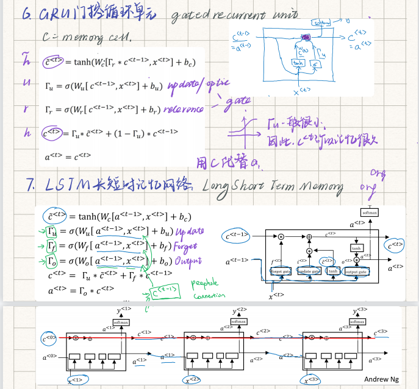

# Deeplearning.AI-Notes
### 吴恩达深度学习课程Deeplearning.AI `PDF手写电子笔记` By Notability
> 本人亲笔书写，良心高质，请放心食用

> 若觉有用，请不吝STAR:star:

### [课程1-3](/Course1-3.pdf) `神经网络和深度学习` `改善神经网络` `结构化机器学习项目`

 

### [课程4](/Course4_CNN.pdf) `卷积神经网络`

  

### [课程5](/Course5_RNN.pdf) `序列模型`

  

$\mathbf{R}_t = \sigma()$ 
